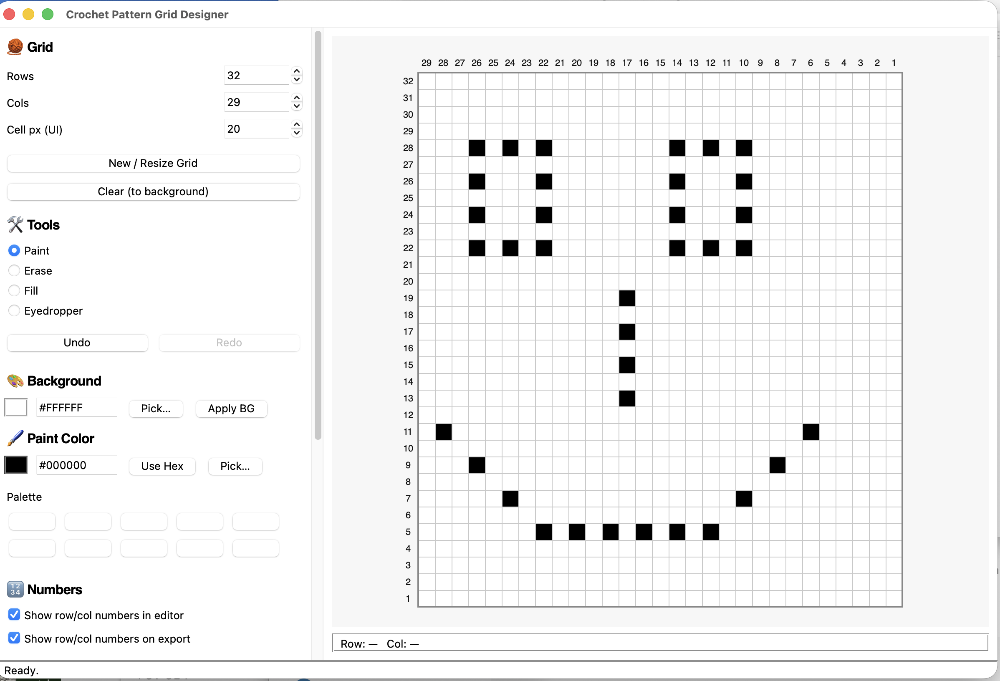

# 🧶 Crochet Pattern Grid Designer (v0.1)

A lightweight desktop application for visually designing crochet
colorwork patterns using a customizable grid.

Built with Python and Tkinter, this tool allows you to create, edit,
save, and export crochet charts in both PNG and PDF formats.

Written by ChatGPT under the direction of Jon Westfall (jon@jonwestfall.com)

------------------------------------------------------------------------

## 📸 Demo



------------------------------------------------------------------------

## ✨ Features

### Grid Design

-   Customizable grid size (rows × columns)
-   Adjustable on-screen cell size
-   Configurable background color
-   Click-and-drag painting
-   Right-click quick erase

### Tools

-   🖌 Paint
-   🧽 Erase
-   🪣 Bucket Fill (flood fill)
-   🎯 Eyedropper (color picker)
-   Undo / Redo support

### Numbering Options

-   Toggle row/column numbers in the editor
-   Toggle row/column numbers in exported files
-   Choose numbering origin:
    -   Bottom-left (standard crochet chart style)
    -   Bottom-right

### Save & Export

-   Save and load projects as JSON
-   Export as PNG (high resolution)
-   Export as PDF (print-friendly)

### Live Cell Readout

-   Displays current row/column under the mouse
-   Updates in real-time while painting

------------------------------------------------------------------------

## 🧰 Installation

### Requirements

-   Python 3.9+
-   Pillow (for PNG export)
-   reportlab (for PDF export)

Install dependencies:

``` bash
pip install pillow reportlab pypandoc
```

------------------------------------------------------------------------

## 🚀 Running the Application

From the project directory:

``` bash
python pattern.py
```

------------------------------------------------------------------------

## 🖱 How to Use

### Basic Workflow

1.  Set your desired grid size.
2.  Choose a background color.
3.  Select a paint color.
4.  Use tools to design your pattern.
5.  Save as JSON to edit later.
6.  Export as PNG or PDF for printing or sharing.

### Mouse Controls

-   **Left-click / Drag** → Uses selected tool
-   **Right-click / Drag** → Quick erase
-   Cell coordinates appear at the bottom of the editor

### Undo / Redo

-   Click Undo / Redo buttons
-   Drag painting counts as a single undo action

------------------------------------------------------------------------

## 📂 File Format (JSON)

Saved JSON files include:

-   Grid size
-   Background color
-   Cell color data
-   Version number

This makes patterns fully reloadable and editable.

------------------------------------------------------------------------

## 🧵 Design Philosophy

This project is designed to be:

-   Lightweight
-   Fully offline
-   Simple to understand
-   Easy to extend

Future versions may include: - Keyboard shortcuts - Symbol overlays -
Stitch-type annotations - Pattern legend generation

------------------------------------------------------------------------

## 📜 License

MIT License.

------------------------------------------------------------------------

## 👤 Author

Created by Jon --- educator, developer, and enthusiast of structured
systems and creative tools.

------------------------------------------------------------------------

Version: 0.1
